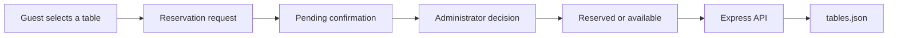

# TableFlow — Restaurant Table Reservations

**An interactive restaurant floor plan with a reservation request and approval workflow.**

HTML · CSS · JavaScript · Node.js · Express

## Overview

TableFlow is a small full-stack reservation prototype. Guests select a table on a visual floor plan, submit their booking details, and see availability. The administrator view manages pending requests and existing reservations. A lightweight Express API persists the table state in a JSON file.

The repository keeps its original URL, `Restaurant-table-reservation`, so existing links continue to work. **TableFlow** is the project display name.

## Features

- Interactive floor plan and list with **14 configured tables** and seat counts.
- Three visible states: available, awaiting confirmation, and reserved.
- Reservation form with guest details, date, and time.
- Client-side validation that rejects dates and times in the past.
- Administrator view to approve or reject requests, edit reservations, and cancel bookings.
- Periodic API refresh to update the displayed table state.
- JSON-file persistence and a health-check endpoint.
- Polish user interface.

## How it works



## Run locally

Prerequisites: Node.js with npm, plus Python 3 for the simple static-file server below.

```powershell
git clone https://github.com/L1BBER/Restaurant-table-reservation.git
cd Restaurant-table-reservation
npm ci
```

Before starting, set `API_URL` near the top of `script.js` to your local API address:

```javascript
const API_URL = "http://localhost:3000/api/tables";
```

Start the API in one terminal:

```powershell
node server/server.js
```

Start the frontend from the repository root in another terminal:

```powershell
python -m http.server 8000 --bind 127.0.0.1
```

Open [the frontend](http://localhost:8000) and check [API health](http://localhost:3000/health).

For a phone on the same network, use the host computer's LAN address instead of `localhost`, and configure local networking deliberately. The existing `start.ps1` contains a machine-specific project path and must be adapted before use; manual startup is the portable route.

## API

| Method | Endpoint | Purpose |
| --- | --- | --- |
| GET | `/health` | Return server status |
| GET | `/api/tables` | Return the full table collection |
| POST | `/api/tables` | Replace the collection with a JSON array |

## Project structure

```text
index.html          Page structure and reservation form
style.css           Floor plan, states, and responsive layout
script.js           Browser state, rendering, forms, and API requests
server/server.js    Express API
server/tables.json  Persisted table data
start.ps1           Original Windows development helper
```

## Scope and limitations

This is a **local educational prototype**, not a production booking service.

- The administrator prompt is implemented in client-side JavaScript; it is a UI demonstration, not authentication or access control.
- The API has no server-side user authorization and allows broad CORS access.
- Each table holds one reservation state. There is no full booking calendar, time-slot conflict engine, payment flow, or confirmation email service.
- Writes replace the entire JSON collection. Concurrent users can overwrite each other's changes.
- The backend validates the outer array shape, not a complete reservation schema.
- Use synthetic guest data when demonstrating the app; avoid exposing it to the public internet in its current form.

## Validation

The repository's `npm test` is currently a placeholder and exits with an error. There is no automated application test suite yet. Useful initial checks are JavaScript syntax validation and a manual create → approve → edit → cancel flow against a disposable copy of the JSON data.

## Engineering focus

The project demonstrates DOM-driven UI state, form handling, a visual availability model, HTTP API integration, and simple backend persistence. Future development should prioritize server-side authentication, schema validation, database transactions, and reservation conflict tests.
